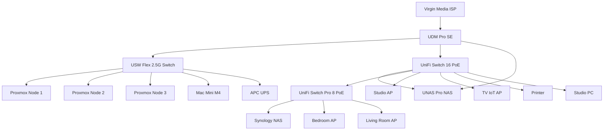

```mermaid
graph TD
    ISP[Virgin Media ISP]
    UDM[UDM Pro SE]
    FLEX[USW Flex 2.5G Switch]
    S16[UniFi Switch 16 PoE]
    S8[UniFi Switch Pro 8 PoE]
    UNAS[UNAS Pro NAS]
    MAC[Mac Mini M4]
    P1[Proxmox Node 1]
    P2[Proxmox Node 2]
    P3[Proxmox Node 3]
    UPS[APC UPS]
    SYNO[Synology NAS]
    AP1[Bedroom AP]
    AP2[Living Room AP]
    AP3[Studio AP]
    AP4[TV IoT AP]
    PRN[Printer]
    PC[Studio PC]

    ISP --> UDM
    UDM --> FLEX
    UDM --> S16
    UDM --> UNAS
    FLEX --> P1
    FLEX --> P2
    FLEX --> P3
    FLEX --> MAC
    FLEX --> UPS
    S16 --> UNAS
    S16 --> S8
    S8 --> SYNO
    S8 --> AP1
    S8 --> AP2
    S16 --> AP3
    S16 --> AP4
    S16 --> PRN
    S16 --> PC
```
